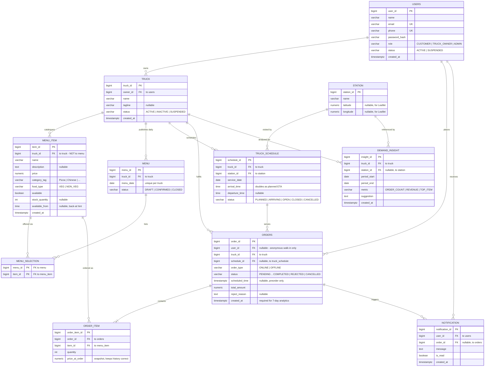

# Bites-N-Wheels — ER Diagram (corrected)

Matches `docs/schema.sql` exactly. GitHub renders the Mermaid block below,
so this is the version to screenshot for the report.

## Diagram

## What changed from the first draft, and why

| # | Change | Reason |
|---|--------|--------|
| 1 | `MENU_ITEM` now hangs off **`TRUCK`**, not `MENU` | Under the old design a dish was recreated for every dated menu, so the same food had a different `item_id` each day. `ORDER_ITEM` points at `MENU_ITEM`, so `GROUP BY item_id` over 7 days returned 7 separate dishes — the demand-analytics feature could not work. It also contradicted the "reusable menu item" API. |
| 2 | Added **`MENU_SELECTION`** join table | Resolves the M:N between a day's menu and the catalogue. This is what `POST /truck/today-setup` writes. |
| 3 | Removed line `USER —uses→ STATION` | No foreign key exists. Users have no relationship to stations. |
| 4 | Removed line `TRUCK_SCHEDULE —creates→ NOTIFICATION` | `NOTIFICATION` only carries `user_id` and `order_id`. True as application logic, but it is not an FK, so it does not belong on an ER diagram. |
| 5 | Removed line `ORDER —generates→ DEMAND_INSIGHT` | `DEMAND_INSIGHT` only carries `truck_id` and `station_id`. Same reason as above. |
| 6 | `USER` → `USERS`, `ORDER` → `ORDERS` | `USER` and `ORDER` are reserved words in PostgreSQL. |
| 7 | Added `created_at` to `ORDERS` | "Last 7 days" analytics is impossible without it. It was in the table spec but missing from the diagram. |
| 8 | `date` → `service_date` on `TRUCK_SCHEDULE` | Diagram and table spec disagreed. |
| 9 | `period` → `period_start` + `period_end` | Same disagreement in `DEMAND_INSIGHT`. |
| 10 | Added `description`, `stock_quantity`, `available_from` to `MENU_ITEM` | `description` was in the spec but not the diagram; the owner availability API sends a `quantity` that had no column; `available_from` backs the "available at 7:00 PM" screen. |
| 11 | `user_id` on `ORDERS` made nullable | Anonymous walk-in offline sales. Guarded by a CHECK so online orders still require a customer. |

## Cardinality

| Relationship | Cardinality | Note |
|---|---|---|
| `USERS` → `TRUCK` | 1 : 0..N | One owner, many trucks |
| `TRUCK` → `MENU_ITEM` | 1 : N | Permanent catalogue |
| `TRUCK` → `MENU` | 1 : N | One per service date (unique) |
| `MENU` ↔ `MENU_ITEM` | M : N | Resolved by `MENU_SELECTION` |
| `TRUCK` → `TRUCK_SCHEDULE` | 1 : N | Many stops across many dates |
| `STATION` → `TRUCK_SCHEDULE` | 1 : N | Many trucks visit, at different times |
| `USERS` → `ORDERS` | 1 : N | Nullable for walk-ins |
| `TRUCK` → `ORDERS` | 1 : N | |
| `TRUCK_SCHEDULE` → `ORDERS` | 1 : N | The stop the order is served at |
| `ORDERS` → `ORDER_ITEM` | 1 : 1..N | An order has at least one line |
| `MENU_ITEM` → `ORDER_ITEM` | 1 : N | A dish appears in many historical orders |
| `USERS` → `NOTIFICATION` | 1 : N | |
| `ORDERS` → `NOTIFICATION` | 1 : 0..N | Nullable |
| `TRUCK` → `DEMAND_INSIGHT` | 1 : N | |
